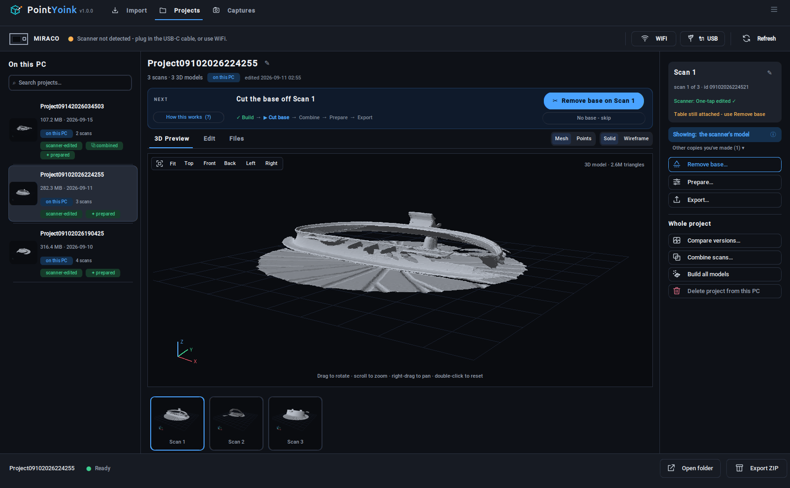
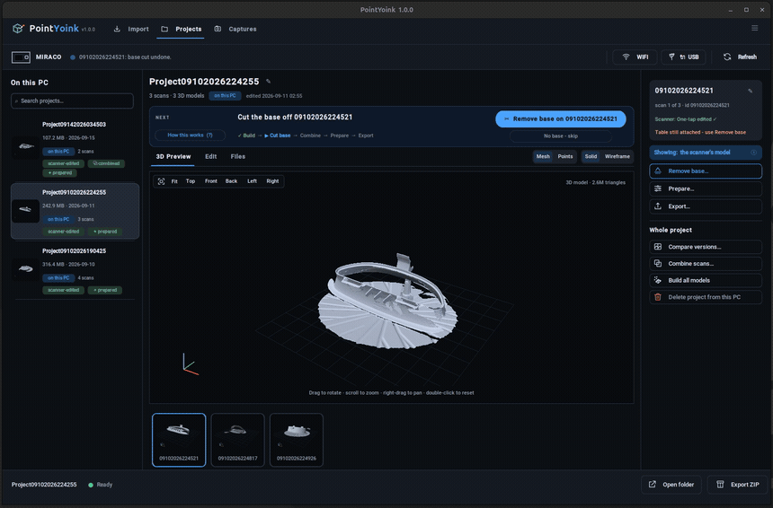
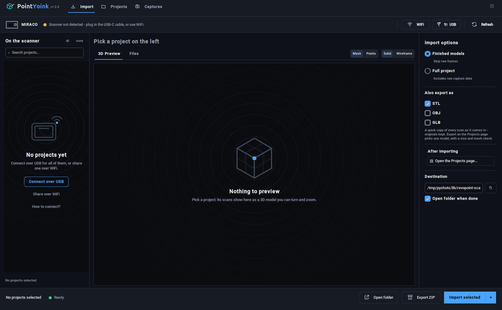
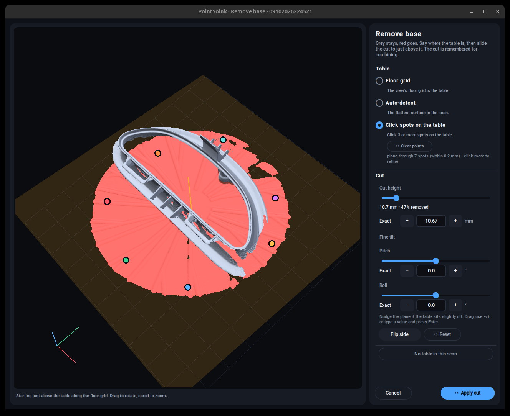
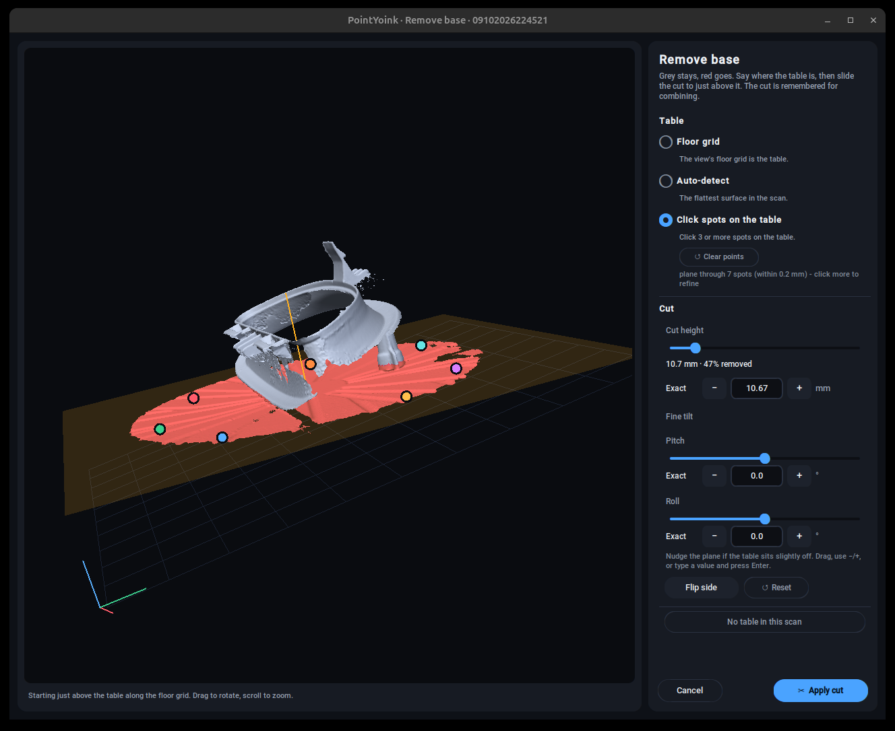
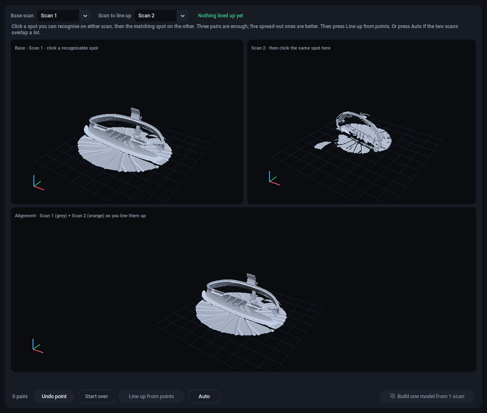
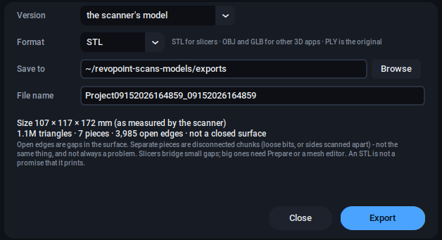

# PointYoink

[](https://github.com/datboip/point-yoink/releases)
[](https://github.com/datboip/point-yoink/releases)
[](LICENSE)


**Pull your Revopoint MIRACO scans onto Linux, clean them up, and export them for editing or printing.**

Revo Scan, the software that goes with Revopoint scanners, runs on Windows, macOS, iOS and Android. There is no Linux version. PointYoink is a small desktop app that fills that gap: plug the MIRACO in (or use WiFi), pull the scans off, then build, cut the base off, combine scans, clean up and export to STL, OBJ, GLB or PLY. Nothing goes online. The scanner's files are only copied, never changed. Prepare and Remove base keep the version they replace; Build and Combine replace their own earlier results.

<p align="center">
  
</p>

> Unofficial. Not affiliated with or endorsed by Revopoint. "Revopoint" and "MIRACO" are trademarks of their respective owners. PointYoink only reads files off your own device and contains none of Revopoint's software.

## Why this exists

I kept giving these companies a chance. I'd back a scanner, wait around for the software to actually show up, and every single one let me down the same way: no love for the penguin.

First the Revopoint Range. It needs a computer to do anything, and the computer has to run Windows or a Mac. Then a 3DMakerpro Seal, same story with different software. Then the MIRACO, which scans on its own without a PC, so I figured this was the one. It is a really nice scanner. It still had nothing for the machine I actually use, so it collected dust for a while.

I did try the workaround everyone points to, running Revo Scan through Wine. It launches, sometimes, and mostly can't see the scanner. So I built the thing I wanted instead. That's PointYoink.

## What it does

<p align="center">
  
</p>
<p align="center"><em>Remove base: the scan comes in with the turntable under it. Here the table is marked by clicking a few spots on it, the cut plane snaps to them (red is what goes), the height and tilt are nudged with the sliders, then Apply. Floor grid and Auto-detect do the same without clicking.</em></p>

- **Import** over USB (the scanner's File Transfer mode) or WiFi (Share to PC, with a 4-digit code the app shows you). Finished models only takes seconds; Full project also brings the raw frames.
- **Build** a model from raw frames on your own PC, using the scanner's registration. Seconds on an NVIDIA card, a few minutes on a CPU. On the scans I have checked it lands within about half a millimetre of the scanner's own One-tap Edit result.
- **Remove base.** Say where the table is: the floor grid, auto-detect, or click three or more spots on it and the plane fits through them. Then set the height by dragging or by typing an exact number, nudge the tilt in half-degree steps if the table sits slightly off, flip sides, apply. The cut is remembered and used again when scans are combined, and you can undo it.
- **Combine** sides you scanned separately. Click matching spots on two scans, or press Auto, check the overlay, keep it, repeat, then build one model from all the frames at once.
- **Prepare** removes floating pieces, smooths, fills small holes and reduces triangles, with the scanner's own defaults. Before and after side by side, then Keep or Discard.
- **Export** as STL, OBJ, GLB or PLY, with the model's size in millimetres, triangle count, separate pieces and open edges shown before you save.
- **Captures** pulls the scanner's screenshots and screen recordings off the device.
- The scanner's model, a model built here, and a prepared or base-cut copy are kept as separate versions. You pick which one the preview and the exports use. Rename projects and scans, compare two versions in linked 3D views, export a project as one ZIP.

## Supported scanners

- MIRACO Pro: tested and working. This is the scanner PointYoink was built on.
- MIRACO and MIRACO Plus: same standalone design, so they should work, but I don't own one. Reports welcome.

Tethered Revopoint scanners (POP, INSPIRE, RANGE, MINI, MetroX) keep their scans on the host PC, not on the device, so there is nothing for PointYoink to pull; they are not supported.

## Install

### Debian / Ubuntu

Download the latest `.deb` from [Releases](https://github.com/datboip/point-yoink/releases) and install it. Dependencies come along automatically.

```bash
sudo apt install ./point-yoink_*_amd64.deb
```

PointYoink then shows up in your application menu, or run `point-yoink`.

### From source

```bash
sudo apt install python3-venv python3-tk python3-pil.imagetk python3-numpy python3-matplotlib python3-networkx jmtpfs rsync
git clone https://github.com/datboip/point-yoink
cd point-yoink
python3 -m venv --system-site-packages venv
./venv/bin/pip install customtkinter pillow numpy trimesh PyOpenGL pyopengltk "pyglet<2" fast-simplification networkx matplotlib
./venv/bin/python pointyoink.py
```

Optional: `./venv/bin/pip install open3d` (about 400 MB; uses the GPU when there is one) for building and combining on the PC, and `ffmpeg` for thumbnails and lengths of the scanner's screen recordings.


## How to use

The app has three pages. **Import** is the scanner. **Projects** is this PC. **Captures** is the scanner's screenshots and recordings.

1. **Import.** Plug in and tap **File Transfer** on the scanner, or click **WiFi** and enter the code on the scanner under Share to PC. Tick the projects, Import. Choose **Full project** if you want to build or combine on the PC.

<p align="center">
  
</p>

2. **Follow the NEXT bar.** With a project open, the bar at the top says what to do now and does it with one button. It walks through the five steps below. **How this works** opens a short guide with a screenshot of each step, on the scanner and in the app.

| Step | What happens | Result |
|---|---|---|
| Build | raw frames become a 3D model (the scanner's One-tap Edit does this too; build here when that didn't turn out right) | `<project>_<scan>_pcfused.ply` |
| Remove base | the table goes red, the part stays grey, Apply | `<project>_<scan>_clean.ply` |
| Combine | line up the sides on matching spots, then fuse all their frames into one model with the tables already gone | `<project>_combined_pcfused.ply` |
| Prepare | floating pieces, smoothing, holes, triangle count, before and after | `<project>_<scan>_clean.ply` |
| Export | STL, OBJ, GLB or PLY with a size and mesh check | the folder you choose |

<p align="center">
  
  
</p>

<p align="center">
  
  
</p>

## How it works

A MIRACO project holds thousands of raw depth frames plus the finished, fused output. **Finished models** copies just the output, so an import moves megabytes instead of gigabytes. **Full project** keeps the scanner's layout with the raw frames, which is what Build and Combine read.

Build fuses the frames in a TSDF volume ([Open3D](https://www.open3d.org/), GPU when available) using the registered poses the scanner writes with every scan. Combine solves a rigid fit from your point pairs (or from feature matching with Auto), refines it with ICP, and fuses every scan's frames into one volume with each scan's table plane removed first. The heavy work runs in child processes; CPU jobs run under an address-space limit: 12 GB for building and registration, 8 GB for alignment, 10 GB for mesh processing. Set `POINTYOINK_MEM_CAP_GB` to override them.

Imported files land in a flat layout with unique names:

```
revopoint-scans-models/
  Project09102026033917/
    Project09102026033917_<scan>.ply           # the scanner's finished model, one per scan
    Project09102026033917_<scan>_pcfused.ply   # a model built on this PC
    Project09102026033917_<scan>_clean.ply     # the prepared or base-cut version
    Project09102026033917_combined_pcfused.ply # one model from all the scans you lined up
    Project09102026033917_<scan>.png           # the scan's preview render
    data/<scan>/...                            # raw frames and the scanner's own files (Full project)
```

## Troubleshooting

- If no scanner is detected, tap File Transfer on the scanner. Plugging in alone is not enough.
- If the File Transfer prompt does not appear, unplug the cable, wait about ten seconds, then reconnect it. A quick replug is often not enough.
- If it is still not detected, try another USB-C cable. Some only charge.
- If connecting fails or hangs, unplug, wait, reconnect, and tap File Transfer again.
- If previews stay blank, the scanner is still waking up. Select the project again.
- Anything else: open **Log** from the menu, copy it, and open an issue.

## Roadmap

- Pick a face to lay flat, the way slicers do, as another way to set the base.
- Confirm the base MIRACO and MIRACO Plus and note any differences from the Pro.

## Privacy

Everything happens on your machine, over USB or your local network. Nothing is uploaded anywhere.

## Contributing

Issues and pull requests are welcome, especially test reports from MIRACO and MIRACO Plus owners.

## License

MIT. See [LICENSE](LICENSE).

## Credits

Full license notices for everything bundled in the `.deb` are in [THIRD_PARTY_NOTICES.md](THIRD_PARTY_NOTICES.md).

## Built with

`jmtpfs` and `libmtp` for device access, `rsync` for the transfer, CustomTkinter and Pillow for the UI, PyOpenGL for the 3D views, `trimesh` for export, and Open3D for building and combining. The MIRACO's on-device project layout was worked out by looking at the files it produces.

## Related projects

Different scanners, different problems, listed in case one of these is the better fit:

- [HazenBabcock/revopoint-python](https://github.com/HazenBabcock/revopoint-python), live control and capture of older tethered scanners (POP, MINI) over WiFi.
- [ifilipis/metrox](https://github.com/ifilipis/metrox), raw-frame processing for the MetroX from PC-side project files.
- [frostworx/revopoint-pop2-linux-info](https://github.com/frostworx/revopoint-pop2-linux-info), notes on running a POP2 on Linux.
